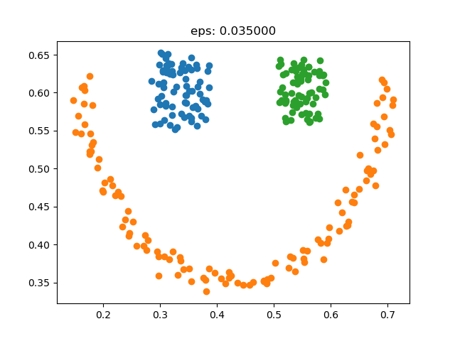
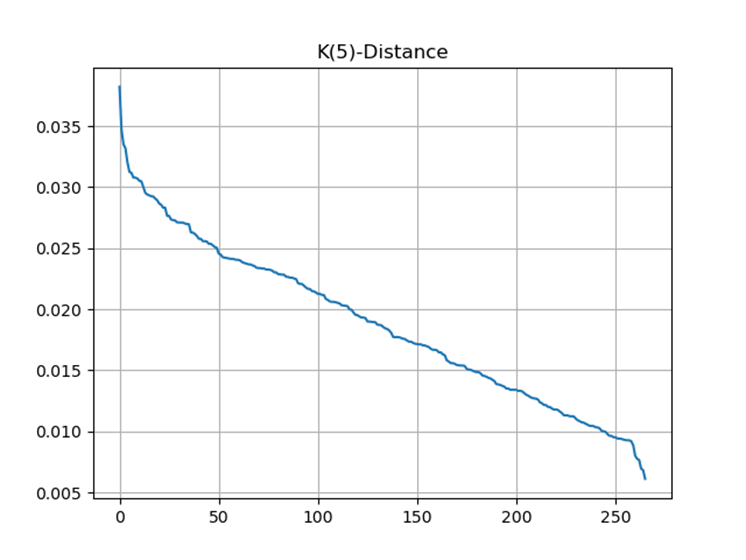

DBSCAN
====
### 1.算法流程

### 2.代码实现
```python
# _*_ coding: utf-8 _*_
"""
Time:     2022-05-20 21:49
Author:   Haolin Yan(XiDian University)
File:     DBSCAN.py
"""
import numpy as np
from loguru import logger
import random
import matplotlib.pyplot as plt

random.seed(2022)


def get_k_distance(X, k=4):
    dim = X.shape[-1]
    RX = np.sum((X[None, ...] - X.reshape(-1, 1, dim)) ** 2, axis=-1) ** 0.5
    dis = np.sort([np.sort(x)[k] for x in RX])[::-1]
    plt.plot(dis)
    plt.title("K(%d)-Distance" % k)
    plt.grid()
    plt.show()
    return dis


class DBSCAN:
    def set_hyparams(self, epsilon, MinPts):
        self.eps = epsilon
        self.MinPts = MinPts

    def get_neighbor(self, i, data):
        epsilon_region = set()
        x = data[i]
        for j, d in enumerate(data):
            dis = np.sum((d - x) ** 2) ** 0.5
            if dis == 0.:
                continue
            if dis <= self.eps:
                epsilon_region.add(j)
        return epsilon_region

    @logger.catch
    def fit(self, X, epsilon=None, MinPts=None, visual=False):
        if epsilon is not None:
            self.eps = epsilon
        if MinPts is not None:
            self.MinPts = MinPts
        # Algorithm line 1~7
        M = len(X)
        C = []
        D = {i for i in range(M)}
        Omega = set()
        for i in range(M):
            epsilon_region = self.get_neighbor(i, X)
            if len(epsilon_region) >= self.MinPts:
                Omega.add(i)

        if visual:
            plt.scatter(X[:, 0], X[:, 1], c="black")
            if len(Omega) != 0:
                core_points = np.array([X[i] for i in Omega])
                plt.scatter(core_points[:, 0], core_points[:, 1], c="red")
                plt.show()

        k = 0
        Gamma = D.copy()
        # line 10~24
        while len(Omega) != 0:
            Gamma_old = Gamma.copy()
            o = random.choice(list(Omega))
            Q = [o]
            Gamma.remove(o)
            # line 14~21
            while len(Q) != 0:
                q = Q.pop(0)
                epsilon_region = self.get_neighbor(q, X)
                if len(epsilon_region) >= self.MinPts:
                    delta = epsilon_region & Gamma
                    for d in delta:
                        Q.append(d)
                        Gamma.remove(d)
            # line 22~24
            k = k + 1
            C_k = Gamma_old - Gamma
            Omega = Omega - C_k
            C.append(np.array([X[idx] for idx in C_k]))
        return C
```

### 数据测试
通过绘制k距离图，可以大致确定epsilon的范围；
#### Smile
